# Simulating Natural Pattern Formation with Reaction Diffusion

## Background

Natural pattern formation is a common phenomena that occurs in nature. In the context of landscapes and ecology, natural pattern formation occurs in semi-arid and dry landscapes. A few examples that occur in the real world are shown below:

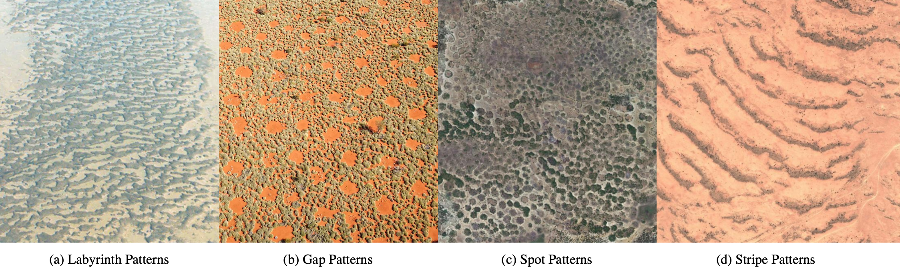

(a) Mussel Bank in the Wadden Sea, The Netherlands (Sun et al. 2021). (b) Fairy Circles in Australia, (Stephan Getzin). (c) Satellite Imagery of Gambia, Google Earth, © Google Inc. (d) Satellite Imagery of Somalia, Google Earth, © Google Inc.

One mechanism used to explain this phenomena is the interaction between local vegetation growth and lateral water transport can introduce perturbations in the system. These perturbations create a positive feedback loop loop that leads to spatial waves and the formation of patterns (Meron 2019). Varying the amount of precipitation leads to the formation of various different patterns.

My project simulates the formation of these patterns using kernel-based reaction diffusion mechanics, which was first described by Kondo (Kondo, Shigeru. 2017. “An Updated Kernel-Based Turing Model for Studying the Mechanisms of Biological Pattern Formation.”). The model convolves a kernel function to compute the growth and decay of vegetation. The kernel itself is made up of an activator function (used to describe any effect that promotes growth) and an inhibitor function, used to describe any effect that reduces growth.

## Usage

This project uses [UV](https://docs.astral.sh/uv/getting-started/installation/) for dependencies. Install uv, clone the project, then run the following inside the project directory to install and run the project:

```shell
uv venv --python 3.12
uv sync
python main.py
```

This will run the single-species interaction window. The multi-species interaction window can be run by running

```shell
python main.py -m
```

## Single Species Interactions

The UI for single-species interactions is shown below:

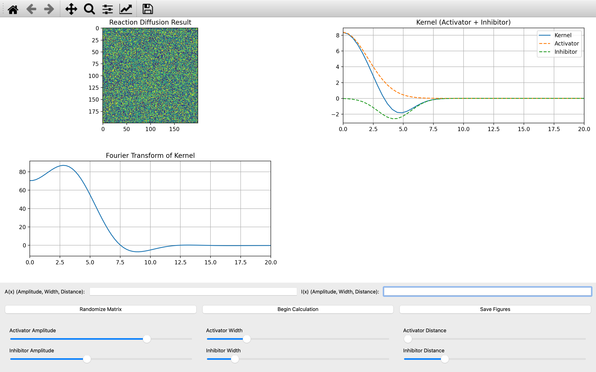

The UI shows the simulation result (upper left), the kernel, including the activation and inhibitor functions (upper right), and the fourier transform of the kernel (lower left). The UI also allows for the amplitude, width, and distance of the kernel to be adjusted. Because the kernel is convolved with the image, both the fourier transform and the integral of the kernel are useful tools for predicting what kind of pattern will be generated.

### Spot and Gap Patterns

Spot and gap patterns occur when the kernel integral is either high or low. Spot patterns occur when the integral is low (between -40 and -20), while gap patterns occur when the integral is high (between 20 and 40). Additionally, the fourier transform must have at least one upwards peak.

Here is an example spot pattern. The kernel integral is -20.0
<p float="left">
  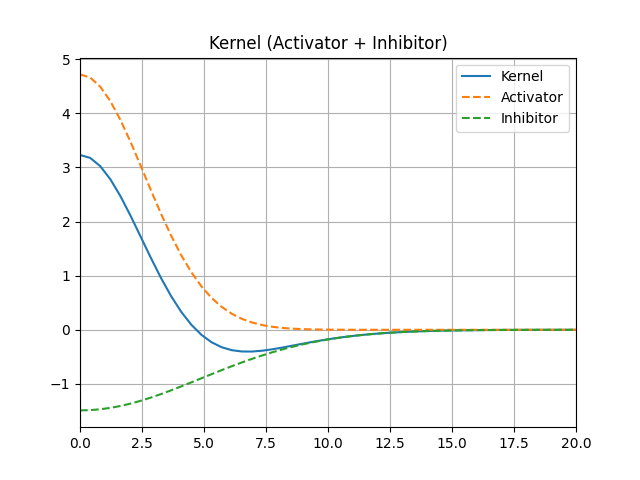
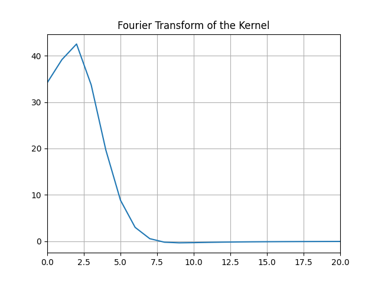
  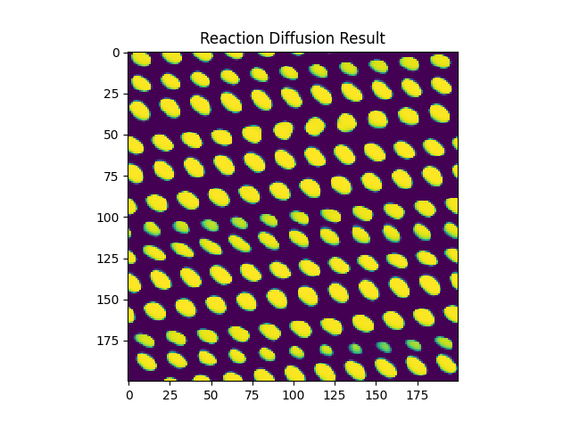
</p>

An example gap pattern. Kernel integral is 21.7
<p float="left">
  
    
  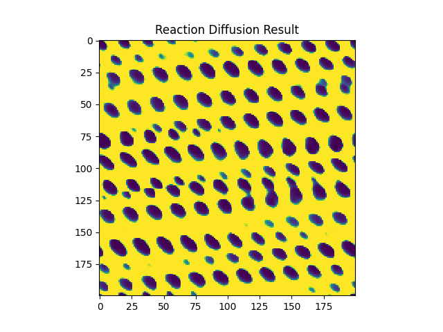
</p>

### Striped Patterns

Stripe and "labyrinth" like patterns occur as the integral of the kernel moves closer to 0. The fourier transform must also have at least one upwards peak.

Example stripe pattern. Kernel integral = 2.05.
<p float="left">
  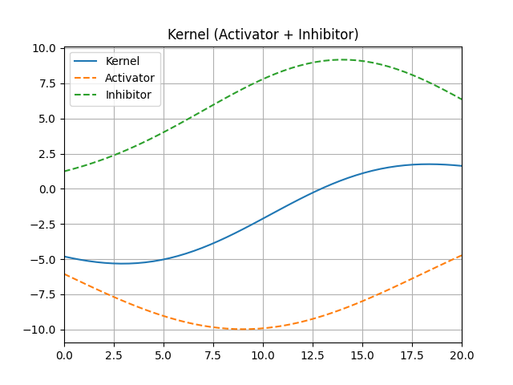
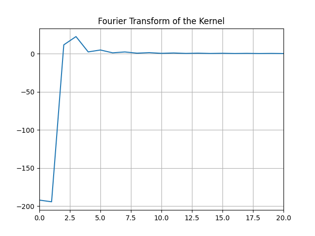
  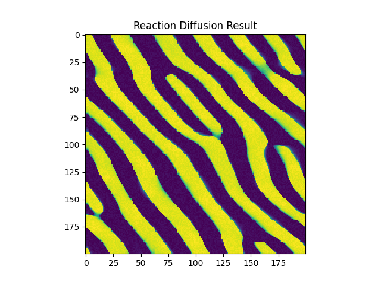
</p>

Example labyrinth pattern. Kernel integral = -0.30.
<p float="left">
  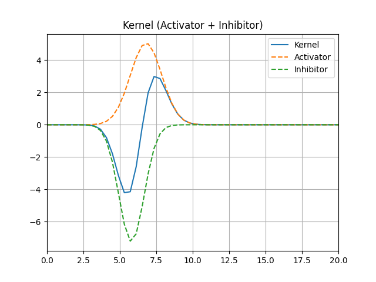
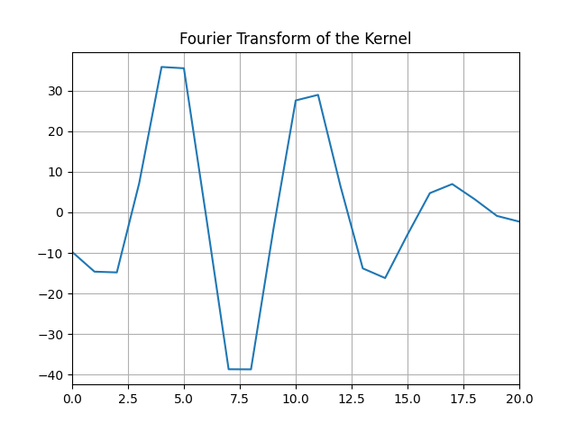
  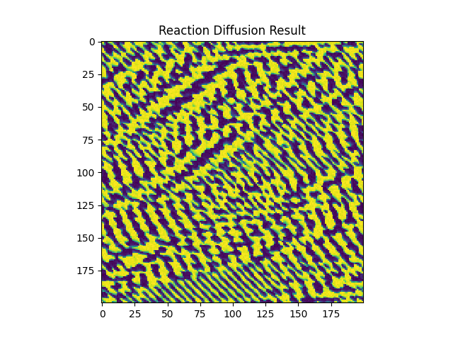
</p>

## Multi-species interactions

In addition to the single-species model, I also implemented a multi-species model. Given two species A and B, the idea is to model their interactions using two different kernel functions. The effect of species A on B is modeled via one kernel, and the effect of species B and species A is modeled using another kernel function.

Here is the UI for multi-species interactions:
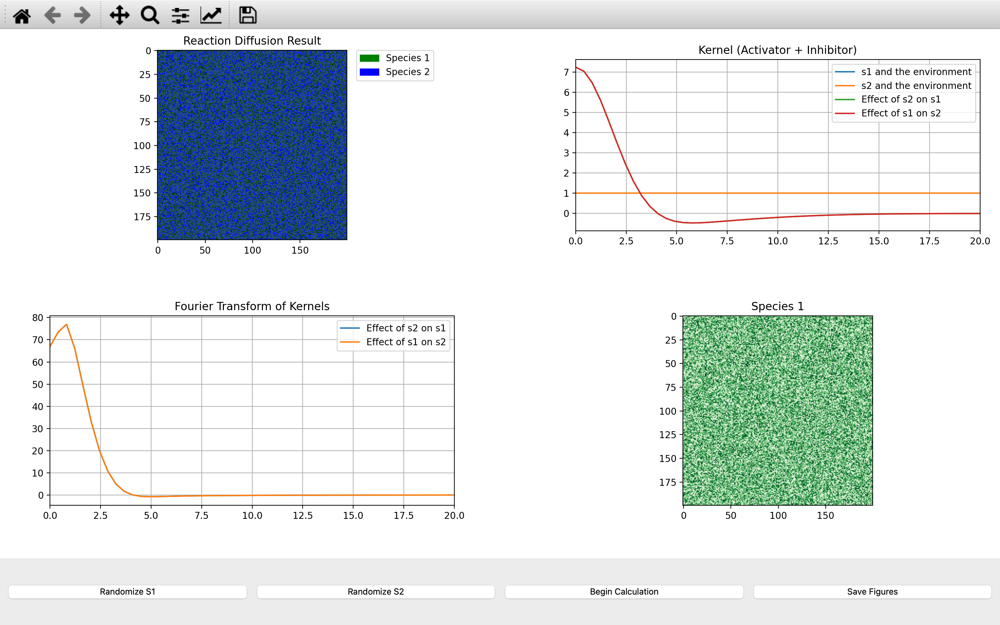

In the top left the simulation result is shown. The top right contains the kernel functions, while the bottom left contains the fourier transforms of the kernels. The bottom right contains a view showing a single species at a time (which can be toggled in the menu).

Here are some interesting example results that the framework can generate:
<p float="left">
  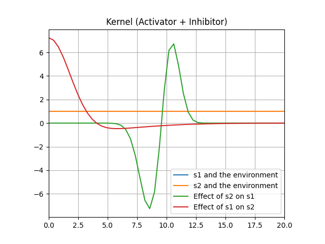
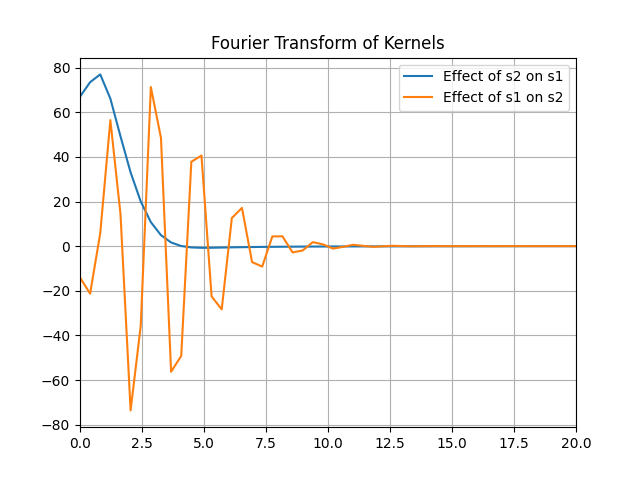
  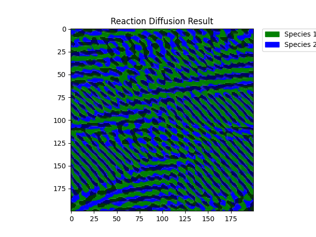
</p>
<p float="left">
  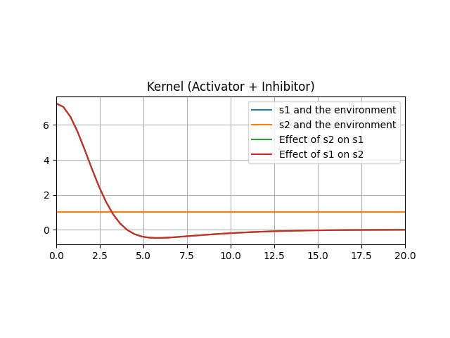
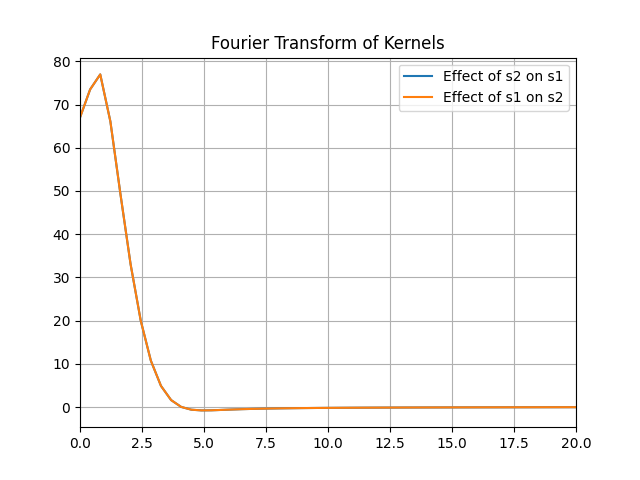
  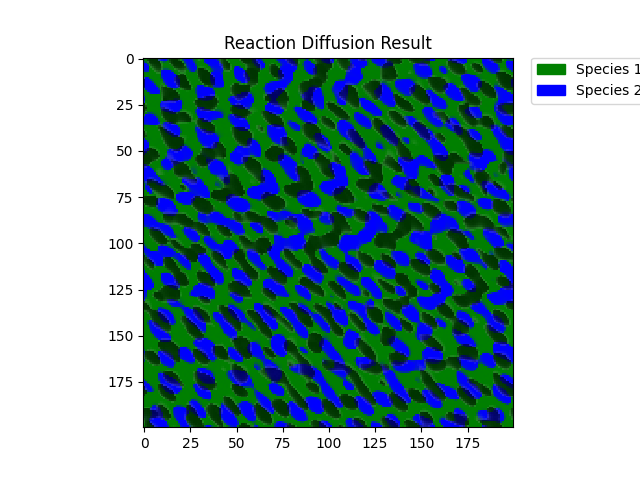
</p>

## Implementation

This project was implemented with python, using the following libraries:
- numpy (arrays and math)
- matplotlib (plots)
- pyqt5 (UI)
- scipy (numerical integration, FFT, smoothing)
- numba (JIT to speed up kernel convolution)
- sqlite (Results are saved to a local database)
